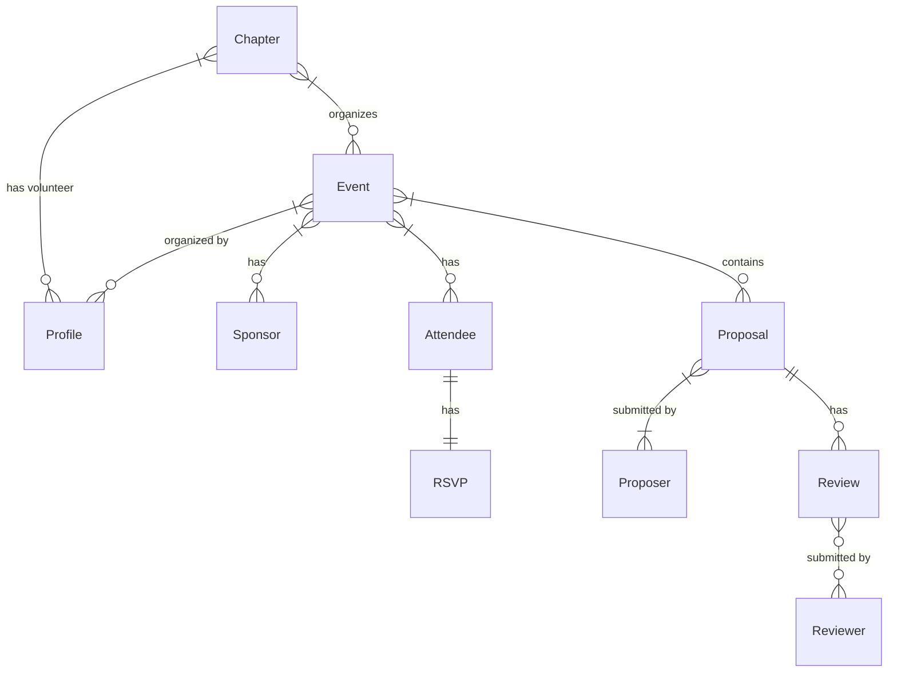
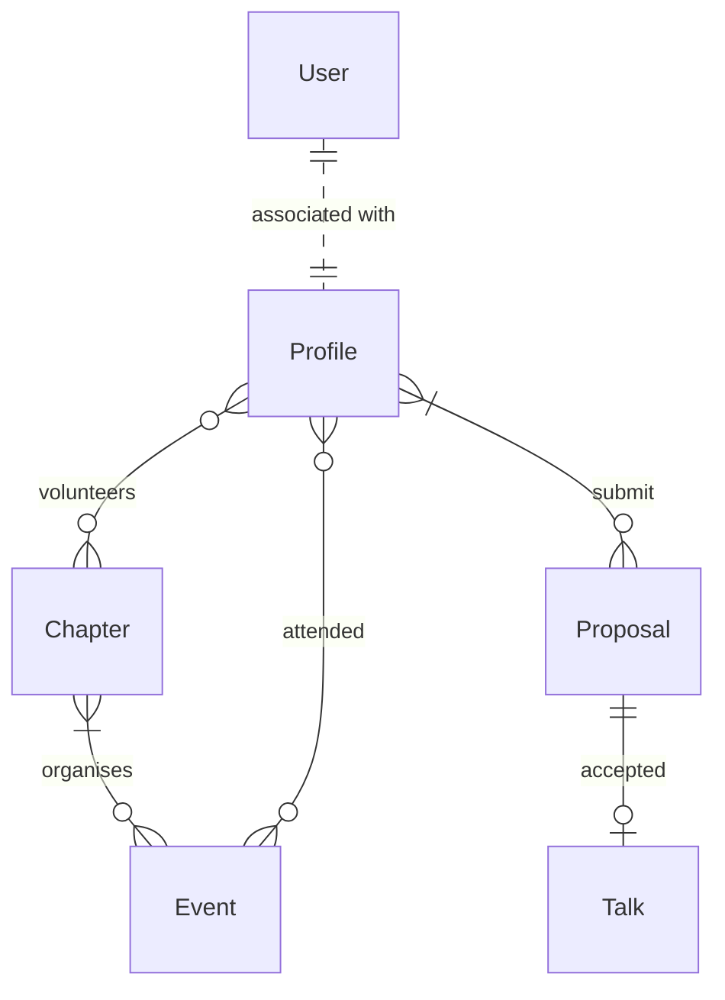
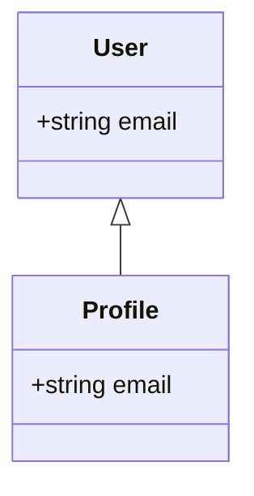

# Architecture of the Platform

The FOSS United Platform is built using the [Frappe framework](https://frappeframework.com/).
In case you're not already aware, applications that use the Frappe framework
are built around [`DocType`s](https://frappeframework.com/docs/user/en/tutorial/create-a-doctype).
For example, the `FOSSUserProfile`, which powers the Profile, is a `DocType`.
The names of a few `DocType`s that are fundamental to the Platform can be
found in `fossunited.doctype_ids`.

If you are unfamiliar with Entity relationship diagrams or if you need a
refresher, you could refer to the wiki section on the [Crow's foot notation](https://en.wikipedia.org/wiki/Entity%E2%80%93relationship_model#Crow's_foot_notation),
or this explainer from [freecodecamp](https://www.freecodecamp.org/news/crows-foot-notation-relationship-symbols-and-how-to-read-diagrams/)

## Entity relationships for a Chapter

## Entity relationships for a Hackathon

(To be completed)

## Entity relationships for a Profile

## Relationship between User and Profile

