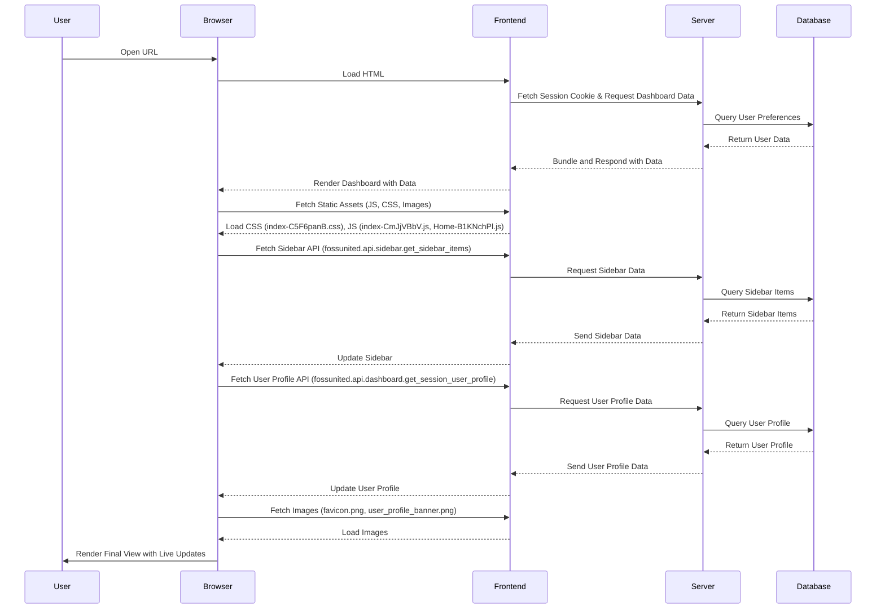
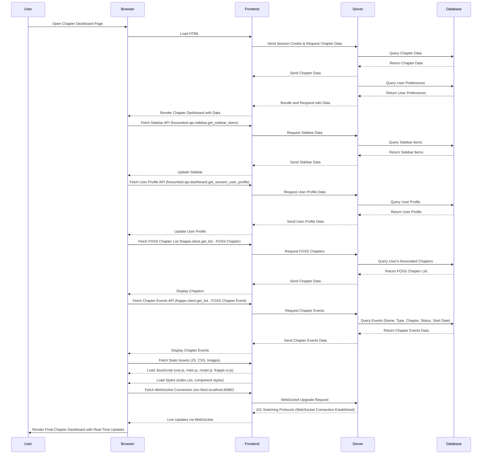

# Sequence Diagram
## Dashboard

```mermaid
sequenceDiagram
    participant User
    participant Browser
    participant Frontend
    participant Server
    participant Database
    User->>Browser: Open URL
    Browser->>Frontend: Load HTML
    Frontend->>Server: Fetch Session Cookie & Request Dashboard Data
    Server->>Database: Query User Preferences
    Database-->>Server: Return User Data
    Server-->>Frontend: Bundle and Respond with Data
    Frontend-->>Browser: Render Dashboard with Data
    Browser->>Frontend: Fetch Static Assets (JS, CSS, Images)
    Frontend-->>Browser: Load CSS (index-C5F6panB.css), JS (index-CmJjVBbV.js, Home-B1KNchPl.js)
    Browser->>Frontend: Fetch Sidebar API (fossunited.api.sidebar.get_sidebar_items)
    Frontend->>Server: Request Sidebar Data
    Server->>Database: Query Sidebar Items
    Database-->>Server: Return Sidebar Items
    Server-->>Frontend: Send Sidebar Data
    Frontend-->>Browser: Update Sidebar
    Browser->>Frontend: Fetch User Profile API (fossunited.api.dashboard.get_session_user_profile)
    Frontend->>Server: Request User Profile Data
    Server->>Database: Query User Profile
    Database-->>Server: Return User Profile
    Server-->>Frontend: Send User Profile Data
    Frontend-->>Browser: Update User Profile
    Browser->>Frontend: Fetch Images (favicon.png, user_profile_banner.png)
    Frontend-->>Browser: Load Images
    Browser->>User: Render Final View with Live Updates
```
## Chapter Events

```mermaid
sequenceDiagram
    participant User
    participant Browser
    participant Frontend
    participant Server
    participant Database
    User->>Browser: Open Chapter Dashboard Page
    Browser->>Frontend: Load HTML
    Frontend->>Server: Send Session Cookie & Request Chapter Data
    Server->>Database: Query Chapter Data
    Database-->>Server: Return Chapter Data
    Server-->>Frontend: Send Chapter Data
    Server->>Database: Query User Preferences
    Database-->>Server: Return User Preferences
    Server-->>Frontend: Bundle and Respond with Data
    Frontend-->>Browser: Render Chapter Dashboard with Data
    Browser->>Frontend: Fetch Sidebar API (fossunited.api.sidebar.get_sidebar_items)
    Frontend->>Server: Request Sidebar Data
    Server->>Database: Query Sidebar Items
    Database-->>Server: Return Sidebar Items
    Server-->>Frontend: Send Sidebar Data
    Frontend-->>Browser: Update Sidebar
    Browser->>Frontend: Fetch User Profile API (fossunited.api.dashboard.get_session_user_profile)
    Frontend->>Server: Request User Profile Data
    Server->>Database: Query User Profile
    Database-->>Server: Return User Profile
    Server-->>Frontend: Send User Profile Data
    Frontend-->>Browser: Update User Profile
    Browser->>Frontend: Fetch FOSS Chapter List (frappe.client.get_list - FOSS Chapter)
    Frontend->>Server: Request FOSS Chapters
    Server->>Database: Query User's Associated Chapters
    Database-->>Server: Return FOSS Chapter List
    Server-->>Frontend: Send Chapter Data
    Frontend-->>Browser: Display Chapters
    Browser->>Frontend: Fetch Chapter Events API (frappe.client.get_list - FOSS Chapter Event)
    Frontend->>Server: Request Chapter Events
    Server->>Database: Query Events (Name, Type, Chapter, Status, Start Date)
    Database-->>Server: Return Chapter Events Data
    Server-->>Frontend: Send Chapter Events Data
    Frontend-->>Browser: Display Chapter Events
    Browser->>Frontend: Fetch Static Assets (JS, CSS, Images)
    Frontend-->>Browser: Load JavaScript (vue.js, main.js, router.js, frappe-ui.js)
    Frontend-->>Browser: Load Styles (index.css, component styles)
    Browser->>Frontend: Fetch WebSocket Connection (ws://test.localhost:8080/)
    Frontend->>Server: WebSocket Upgrade Request
    Server-->>Frontend: 101 Switching Protocols (WebSocket Connection Established)
    Frontend-->>Browser: Live Updates via WebSocket
    Browser->>User: Render Final Chapter Dashboard with Real-Time Updates
```
